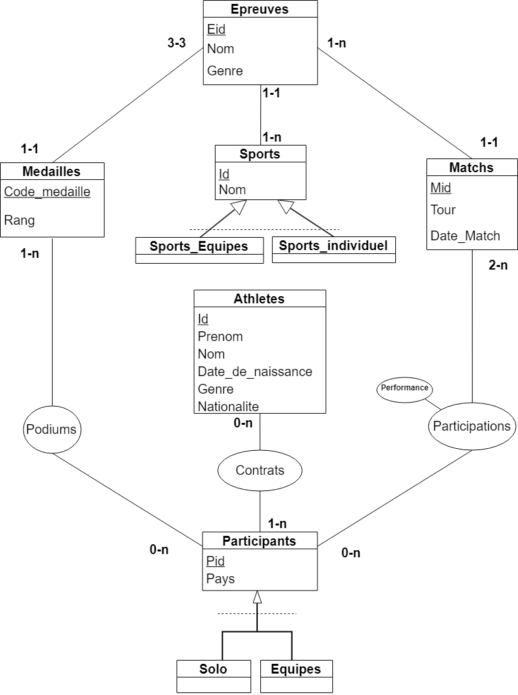
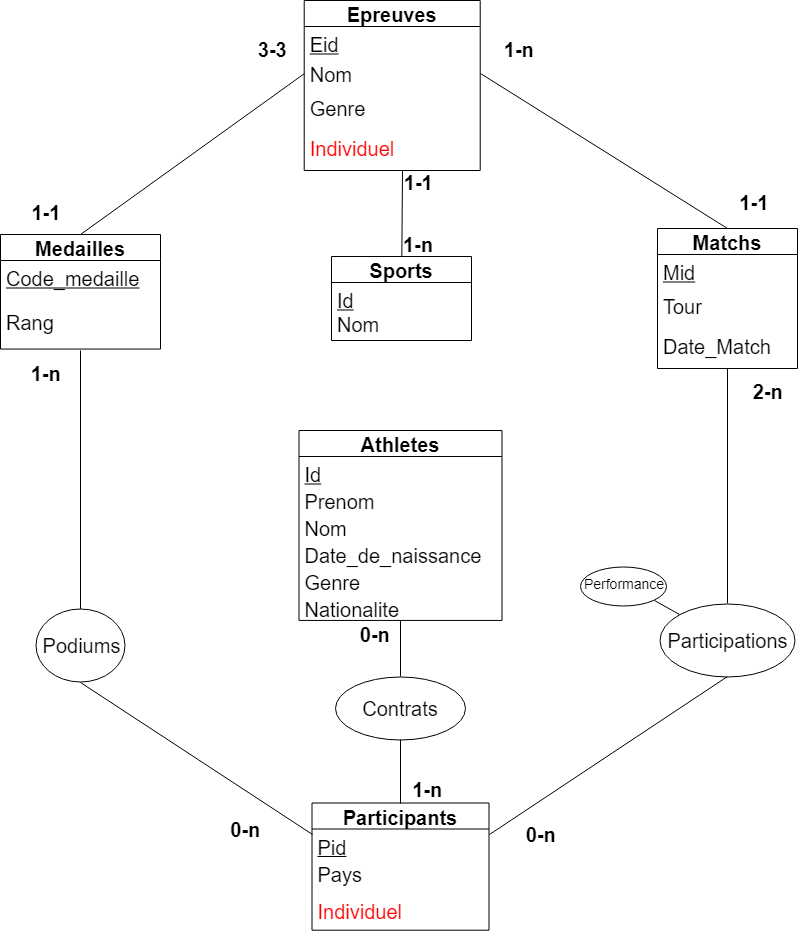

# Base de données pour les Jeux Olympiques   

   

*Projet réalisé en binôme dans le cadre du cours "Bases de données" (projet "Rio ne répond plus")*   
**Auteurs : [Joël Hamilcaro](https://github.com/Joel-Hamilcaro/) et [Jie Tu](https://github.com/jie-tu)**       

Le but de ce projet était de modéliser et d'implémenter une base de donnée SQL utilisable pour l'organisation d'événements sportifs (gestion du calendrier des évènements, des résultats, des différents sports, des équipes/athlètes, des médailles, ...). Pour peupler notre base de données, nous avons utilisé les données des jeux olympiques d'été de Rio 2016.

## Modélisation Entité-Relation

## Modélisation restructurée

## Schéma relationnel

Athletes(**id**,prenom,nom,date_de_naissance,genre,nationalite)   
Participants(**pid**,pays,individuel)   
Sports(**sid**,nom)   
Contrats( **id#,pid#** )   
    - Contrats[id] ∈ Athlete[id] et Contrats[pid] ∈ Participants[pid]   
Epreuves(**eid**,sid#,nom,genre,individuel)   
    - Epreuves[sid] ∈ Sports[sid]   
Matchs(**mid**,eid#,tour,date_match)   
    - Matchs[eid] ∈ Epreuves[eid]   
Participations (**mid#, pid#** ,performance )   
    - Participations[mid] ∈ Matchs[mid]   
Medailles(**code_medaille**,eid#,rang)   
    - Medailles[eid] ∈ Epreuve[eid] et Medailles[rang] ∈ {’or’, ’argent’, ’bronze’}   
Podiums( **code_medaille#,pid#** )   
    - Podiums[code_medaille] ∈ Medailles[code_medaille] et Podiums[pid] ∈ Participants[pid]   

## Architecture

Dans le dossier courant se trouve :

- `README.md`

- `rapport.pdf` (contenant le rapport de projet et la modélisation)

- `projet.sql`
     (contient les commandes d'initialisation et l'ensemble des requêtes)
- `requete.sql`

- `paris2024.sql`

- `pack`
     (contient l'ensemble des fichiers qui ont permis de peupler les tables)

____________________________________________________________________________

## Lancement

- Pour initialiser les tables `\i projet.sql`
- Pour lancer les requêtes `\i requetes.sql`
- Pour initialiser les données et le calcul de volontaires `\i paris2024.sql`

___________________________________________________________________________
